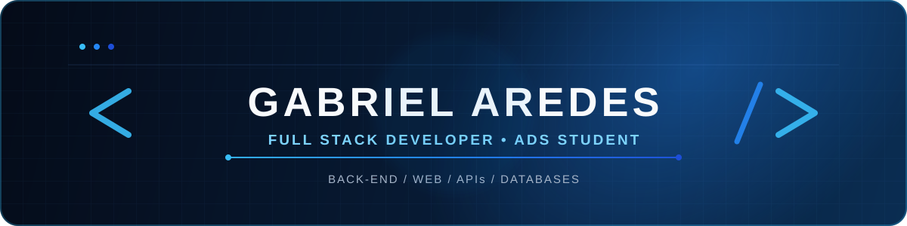

  <strong>Desenvolvedor Full Stack em formação</strong> 
  Construindo aplicações web completas, APIs seguras e soluções orientadas a problemas reais.

  <a href="https://www.linkedin.com/in/gabrielaredesatf/">LinkedIn</a>
  &nbsp;•&nbsp;
  <a href="https://github.com/gabriel-aredes011?tab=repositories">Projetos</a>
  &nbsp;•&nbsp;
  Guarulhos, SP

---

## Sobre mim

Sou estudante de **Análise e Desenvolvimento de Sistemas**, apaixonado por tecnologia, desenvolvimento de software e resolução de problemas. Minha experiência combina desenvolvimento **front-end**, **back-end**, integração com **APIs REST**, bancos de dados relacionais e conhecimentos práticos de suporte técnico e hardware.

Em 2025, participei do **ENIAC Academy — Hub de Carreiras**, desenvolvendo projetos com diferentes tecnologias. Um dos trabalhos da equipe foi uma plataforma gratuita de cursos de tecnologia com emissão de certificados, selecionada para a **PROJWEEK 2025**.

Hoje concentro meus estudos na construção de sistemas completos e bem estruturados, aplicando boas práticas de versionamento, segurança, documentação e trabalho em equipe.

> Meu objetivo é conquistar minha primeira oportunidade profissional em tecnologia, contribuir com projetos reais e evoluir continuamente como desenvolvedor.

---

## Foco atual

<table>
  <tr>
    <td width="50%" valign="top">
      <h3>🚀 Desenvolvimento</h3>
      <ul>
        <li>Aplicações web modernas e responsivas</li>
        <li>APIs REST e regras de negócio</li>
        <li>Autenticação e autorização com JWT</li>
        <li>Integração com bancos de dados</li>
      </ul>
    </td>
    <td width="50%" valign="top">
      <h3>📚 Evolução técnica</h3>
      <ul>
        <li>C# e ASP.NET Core</li>
        <li>React e desenvolvimento mobile</li>
        <li>PostgreSQL e modelagem de dados</li>
        <li>Testes e colaboração com GitHub</li>
      </ul>
    </td>
  </tr>
</table>

---

## Tecnologias

### Back-end e linguagens

<table align="center">
  <tr>
    <td align="center" width="110">
       
      <b>Java</b>
    </td>
    <td align="center" width="110">
       
      <b>Spring Boot</b>
    </td>
    <td align="center" width="110">
       
      <b>Python</b>
    </td>
    <td align="center" width="110">
       
      <b>PHP</b>
    </td>
    <td align="center" width="110">
       
      <b>C#</b>
    </td>
    <td align="center" width="110">
       
      <b>ASP.NET Core</b>
    </td>
  </tr>
</table>

### Front-end

<table align="center">
  <tr>
    <td align="center" width="110">
       
      <b>Angular</b>
    </td>
    <td align="center" width="110">
       
      <b>React</b>
    </td>
    <td align="center" width="110">
       
      <b>TypeScript</b>
    </td>
    <td align="center" width="110">
       
      <b>JavaScript</b>
    </td>
    <td align="center" width="110">
       
      <b>HTML5</b>
    </td>
    <td align="center" width="110">
       
      <b>CSS3</b>
    </td>
  </tr>
</table>

### Dados, APIs e segurança

<table align="center">
  <tr>
    <td align="center" width="110">
       
      <b>PostgreSQL</b>
    </td>
    <td align="center" width="110">
       
      <b>MySQL</b>
    </td>
    <td align="center" width="110">
       
      <b>Hibernate</b>
    </td>
    <td align="center" width="110">
       
      <b>REST APIs</b>
    </td>
    <td align="center" width="110">
       
      <b>JWT</b>
    </td>
    <td align="center" width="110">
       
      <b>JSON</b>
    </td>
  </tr>
</table>

### Ferramentas

<table align="center">
  <tr>
    <td align="center" width="110">
       
      <b>Git</b>
    </td>
    <td align="center" width="110">
       
      <b>GitHub</b>
    </td>
    <td align="center" width="110">
       
      <b>VS Code</b>
    </td>
    <td align="center" width="110">
       
      <b>Visual Studio</b>
    </td>
    <td align="center" width="110">
       
      <b>Eclipse</b>
    </td>
    <td align="center" width="110">
       
      <b>Postman</b>
    </td>
  </tr>
</table>

---

## Projetos em destaque

| Projeto | O que estou construindo | Tecnologias | Momento |
|:--|:--|:--|:--|
| [**DevTasker**](https://github.com/gabriel-aredes011/DevTasker-Web) | Plataforma para desenvolvedores organizarem projetos e tarefas em quadros Kanban | Java, Spring Boot, Angular, PostgreSQL, JWT | Em desenvolvimento |
| **Sistema de Controle de Estoque** | Sistema web local e aplicativo para gerenciar produtos, entradas, saídas e inventário | C#, ASP.NET Core, React, PostgreSQL | Iniciando |
| [**TechBridge**](https://github.com/gabriel-aredes011/TechBridge-Conectando-Talentos) | Plataforma que conecta estudantes a oportunidades e conteúdos de capacitação | PHP, JavaScript, HTML, CSS, MySQL | Projeto acadêmico |
| **Plataforma de Cursos** | Cursos gratuitos de tecnologia, acompanhamento de progresso e emissão de certificados | PHP, JavaScript, HTML, CSS, MySQL | PROJWEEK 2025 |

### DevTasker

Meu principal projeto de portfólio. Possui uma base em **Java com Spring Boot**, persistência com **PostgreSQL e Hibernate/JPA**, autenticação com **Spring Security, BCrypt e JWT**, além de front-end em **Angular**. O próximo grande módulo é o dashboard com quadro Kanban e drag and drop.

### Sistema de Controle de Estoque

Projeto profissional em grupo para atender uma empresa específica. A solução será composta por **API em C# e ASP.NET Core**, aplicação web em **React**, banco **PostgreSQL** e um aplicativo integrado ao mesmo ecossistema.

---

## Trajetória

<table>
  <tr>
    <td width="18%" align="center"><strong>2021</strong></td>
    <td>
      <strong>Actyon Solutions</strong> 
      Estágio remoto em parceria com o Colégio ENIAC, atuando no controle e na organização de atividades com Microsoft Excel e ferramentas digitais. Fui reconhecido como <strong>Funcionário do Mês</strong>.
    </td>
  </tr>
  <tr>
    <td width="18%" align="center"><strong>2025</strong></td>
    <td>
      <strong>ENIAC Academy — Hub de Carreiras</strong> 
      Desenvolvimento de projetos com PHP, Python, JavaScript, HTML, CSS e MySQL. A experiência fortaleceu meus conhecimentos técnicos, comunicação e trabalho em equipe.
    </td>
  </tr>
  <tr>
    <td width="18%" align="center"><strong>2025</strong></td>
    <td>
      <strong>PROJWEEK</strong> 
      Plataforma de cursos gratuitos de tecnologia selecionada para apresentação a uma banca avaliadora na PROJWEEK 2025.
    </td>
  </tr>
</table>

---

## Além do código

Também possuo experiência prática com:

- Montagem e configuração de computadores
- Instalação de sistemas operacionais e softwares
- Upgrades e otimização de notebooks e desktops
- Diagnóstico de falhas de hardware
- Organização e priorização de demandas técnicas

---

## Atividade no GitHub

Os cartões são atualizados automaticamente e consideram os dados disponíveis no GitHub.

---

## Contribuições

<picture>
  <source media="(prefers-color-scheme: dark)" srcset="https://raw.githubusercontent.com/gabriel-aredes011/gabriel-aredes011/output/github-contribution-grid-snake-dark.svg" />
  <source media="(prefers-color-scheme: light)" srcset="https://raw.githubusercontent.com/gabriel-aredes011/gabriel-aredes011/output/github-contribution-grid-snake.svg" />
  
</picture>

---

## Vamos conversar?

Estou em busca da minha primeira oportunidade profissional em tecnologia e aberto a conexões, projetos e novos aprendizados.

 

&nbsp;&nbsp;&nbsp;

  <a href="https://www.linkedin.com/in/gabrielaredesatf/"><strong>LinkedIn</strong></a>
  &nbsp;•&nbsp;
  <a href="https://github.com/gabriel-aredes011"><strong>GitHub</strong></a>

 

<strong>Aprendendo, construindo e evoluindo — um projeto de cada vez.</strong>

